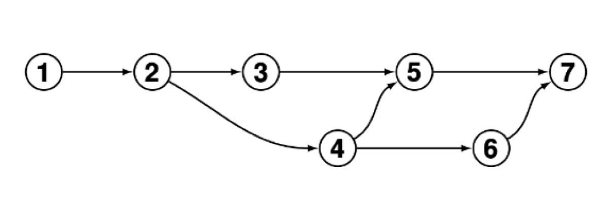

# EITI - Sistemas Embebidos 2022

## Trabajo Practico N° 1

**Docente:** _Ing. Esteban Daniel Volentini_

**Autor:** _Ing. Federico Interlandi Zoireff_

`Se deberá crear un repositorio git con acceso público que tenga por lo menos 7 versiones (commits) de un proyecto, las cuales deberán cumplir los siguientes requisitos:`

> En la primera versión se deberá agregar un archivo README.MD donde se indique por lo menos el nombre completo del alumno, la asignatura y a que trabajo práctico corresponde el repositorio.

> También se deberá crear un archivo .gitignore para omitir todos los archivos del tipo html y el contenido de la carpeta output.

> En la segunda versión se deberán crear como mínimo dos archivos con, por lo menos, cinco líneas de texto cada uno.

> En la tercera y cuarta versiones se harán cambios independientes que no generen conflictos a partir de la segunda versión.

> La quinta versión tomará como punto de partida la tercera versión para mezclar los cambios realizados en la cuarta versión.

> La sexta versión tomará como punto de partida a la cuarta versión y realizará cambios que generen conflictos con los cambios efectuados en la tercera versión.

> La séptima versión tomará como punto de partida la quinta versión para mezclar los cambios realizados en la sexta versión.

